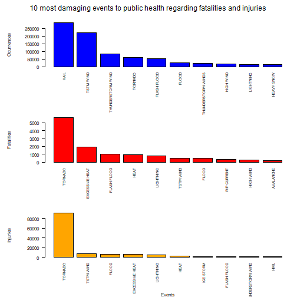
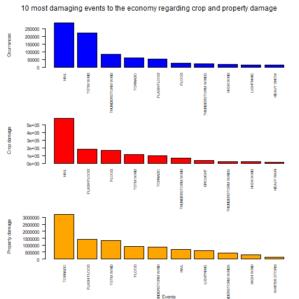

# Analysing the impact of severe weather events on health and economy

## Synopsis

This is a second course project for Reproducible Research course which is part of the Coursera’s Data Science Specialization.

Storms and other severe weather events are responsible for both public health and economic problems for communities and municipalities. Many severe weather events can result in fatalities, injuries, and property damage, and preventing such outcomes to the extent possible is a key concern.

This project involves exploring the U.S. National Oceanic and Atmospheric Administration’s (NOAA) storm database to find out what are the most damaging weather events. This database tracks characteristics of major storms and weather events in the United States, including when and where they occur, as well as estimates of any fatalities, injuries, and property damage.


## Data Processing

Loading the dataset(assuming it is placed in the same directory as this document).

```r
require(dplyr)
require(ggplot2)
require(gridExtra)
weatherDF <- read.csv("repdata_data_StormData.csv")
summary(weatherDF)
```

```
##     STATE__       BGN_DATE           BGN_TIME          TIME_ZONE             COUNTY       COUNTYNAME       
##  Min.   : 1.0   Length:902297      Length:902297      Length:902297      Min.   :  0.0   Length:902297     
##  1st Qu.:19.0   Class :character   Class :character   Class :character   1st Qu.: 31.0   Class :character  
##  Median :30.0   Mode  :character   Mode  :character   Mode  :character   Median : 75.0   Mode  :character  
##  Mean   :31.2                                                            Mean   :100.6                     
##  3rd Qu.:45.0                                                            3rd Qu.:131.0                     
##  Max.   :95.0                                                            Max.   :873.0                     
##                                                                                                            
##     STATE              EVTYPE            BGN_RANGE          BGN_AZI           BGN_LOCATI          END_DATE        
##  Length:902297      Length:902297      Min.   :   0.000   Length:902297      Length:902297      Length:902297     
##  Class :character   Class :character   1st Qu.:   0.000   Class :character   Class :character   Class :character  
##  Mode  :character   Mode  :character   Median :   0.000   Mode  :character   Mode  :character   Mode  :character  
##                                        Mean   :   1.484                                                           
##                                        3rd Qu.:   1.000                                                           
##                                        Max.   :3749.000                                                           
##                                                                                                                   
##    END_TIME           COUNTY_END COUNTYENDN       END_RANGE          END_AZI           END_LOCATI       
##  Length:902297      Min.   :0    Mode:logical   Min.   :  0.0000   Length:902297      Length:902297     
##  Class :character   1st Qu.:0    NA's:902297    1st Qu.:  0.0000   Class :character   Class :character  
##  Mode  :character   Median :0                   Median :  0.0000   Mode  :character   Mode  :character  
##                     Mean   :0                   Mean   :  0.9862                                        
##                     3rd Qu.:0                   3rd Qu.:  0.0000                                        
##                     Max.   :0                   Max.   :925.0000                                        
##                                                                                                         
##      LENGTH              WIDTH                F               MAG            FATALITIES          INJURIES        
##  Min.   :   0.0000   Min.   :   0.000   Min.   :0.0      Min.   :    0.0   Min.   :  0.0000   Min.   :   0.0000  
##  1st Qu.:   0.0000   1st Qu.:   0.000   1st Qu.:0.0      1st Qu.:    0.0   1st Qu.:  0.0000   1st Qu.:   0.0000  
##  Median :   0.0000   Median :   0.000   Median :1.0      Median :   50.0   Median :  0.0000   Median :   0.0000  
##  Mean   :   0.2301   Mean   :   7.503   Mean   :0.9      Mean   :   46.9   Mean   :  0.0168   Mean   :   0.1557  
##  3rd Qu.:   0.0000   3rd Qu.:   0.000   3rd Qu.:1.0      3rd Qu.:   75.0   3rd Qu.:  0.0000   3rd Qu.:   0.0000  
##  Max.   :2315.0000   Max.   :4400.000   Max.   :5.0      Max.   :22000.0   Max.   :583.0000   Max.   :1700.0000  
##                                         NA's   :843563                                                           
##     PROPDMG         PROPDMGEXP           CROPDMG         CROPDMGEXP            WFO             STATEOFFIC       
##  Min.   :   0.00   Length:902297      Min.   :  0.000   Length:902297      Length:902297      Length:902297     
##  1st Qu.:   0.00   Class :character   1st Qu.:  0.000   Class :character   Class :character   Class :character  
##  Median :   0.00   Mode  :character   Median :  0.000   Mode  :character   Mode  :character   Mode  :character  
##  Mean   :  12.06                      Mean   :  1.527                                                           
##  3rd Qu.:   0.50                      3rd Qu.:  0.000                                                           
##  Max.   :5000.00                      Max.   :990.000                                                           
##                                                                                                                 
##   ZONENAMES            LATITUDE      LONGITUDE        LATITUDE_E     LONGITUDE_       REMARKS              REFNUM      
##  Length:902297      Min.   :   0   Min.   :-14451   Min.   :   0   Min.   :-14455   Length:902297      Min.   :     1  
##  Class :character   1st Qu.:2802   1st Qu.:  7247   1st Qu.:   0   1st Qu.:     0   Class :character   1st Qu.:225575  
##  Mode  :character   Median :3540   Median :  8707   Median :   0   Median :     0   Mode  :character   Median :451149  
##                     Mean   :2875   Mean   :  6940   Mean   :1452   Mean   :  3509                      Mean   :451149  
##                     3rd Qu.:4019   3rd Qu.:  9605   3rd Qu.:3549   3rd Qu.:  8735                      3rd Qu.:676723  
##                     Max.   :9706   Max.   : 17124   Max.   :9706   Max.   :106220                      Max.   :902297  
##                     NA's   :47                      NA's   :40
```

### PART 1 - Effects on public heatlh

Table with injuries and fatalities for each event, as well as the number of occurrences.


```r
healthTableSum <- cbind(aggregate(FATALITIES ~ EVTYPE, data=df, sum), aggregate(INJURIES ~ EVTYPE, data=df, sum)$INJURIES)
countTable <- df %>% count(EVTYPE)
healthTable <- cbind(healthTableSum,countTable[2])
colnames(healthTable)[2] <- "FATALITIES"
colnames(healthTable)[3] <- "INJURIES"
colnames(healthTable)[4] <- "OCURRENCES"
```

### PART 2 - Effects on the economy

Table with the sum of crop and property damage for each event.


```r
damageTable <-weatherDF[which(weatherDF$CROPDMGEXP != "" | weatherDF$PROPDMGEXP != ""),]
damageTable[which(damageTable$CROPDMGEXP =="B" | damageTable$CROPDMGEXP =="b" ),]$CROPDMG <- sapply(damageTable[which(damageTable$CROPDMGEXP =="B" | damageTable$CROPDMGEXP =="b"),]$CROPDMG,"*",1000000000)
damageTable[which(damageTable$CROPDMGEXP =="M" | damageTable$CROPDMGEXP =="m" ),]$CROPDMG <- sapply(damageTable[which(damageTable$CROPDMGEXP =="M" | damageTable$CROPDMGEXP =="m"),]$CROPDMG,"*",1000000)
damageTable[which(damageTable$CROPDMGEXP =="K" | damageTable$CROPDMGEXP =="k"),]$CROPDMG <- sapply(damageTable[which(damageTable$CROPDMGEXP =="K" | damageTable$CROPDMGEXP =="k"),]$CROPDMG,"*",1000)
damageTable <-weatherDF[which(weatherDF$PROPDMG > 0 & weatherDF$PROPDMGEXP != "" ),]
damageTable[which(damageTable$PROPDMGEXP =="B" | damageTable$PROPDMGEXP =="b" ),]$PROPDMG <- sapply(damageTable[which(damageTable$PROPDMGEXP =="B" | damageTable$PROPDMGEXP =="b"),]$PROPDMG,"*",1000000000)
damageTable[which(damageTable$PROPDMGEXP =="M" | damageTable$PROPDMGEXP =="m" ),]$PROPDMG <- sapply(damageTable[which(damageTable$PROPDMGEXP =="M" | damageTable$PROPDMGEXP =="m"),]$PROPDMG,"*",1000000)
damageTable[which(damageTable$PROPDMGEXP =="K" | damageTable$PROPDMGEXP =="k"),]$PROPDMG <- sapply(damageTable[which(damageTable$PROPDMGEXP =="K" | damageTable$PROPDMGEXP =="k"),]$PROPDMG,"*",1000)
damageTable <- cbind(aggregate(CROPDMG ~ EVTYPE, data=df, sum), aggregate(PROPDMG ~ EVTYPE, data=df, sum)$PROPDMG)
colnames(damageTable)[3] <- "PROPDMG"
```
## Results

### PART 1 - Effects on public health

First, let's analyze the 10 most fatal and injury making weather events.


```r
par(mfrow = c(3, 1), mar = c(7, 8, 2, 1), oma = c(0, 0, 2, 0),mgp = c(6, 1, 0))
with(head(healthTable[order(-healthTable$OCURRENCES),], 10),barplot(OCURRENCES,names.arg = EVTYPE,ylab= "Ocurrences",,col = "blue", las = 2,cex.names = 0.7))
with(head(healthTable[order(-healthTable$FATALITIES),], 10),barplot(FATALITIES,names.arg = EVTYPE,ylab= "Fatalities",col = "red", las = 2,cex.names = 0.7))
with(head(healthTable[order(-healthTable$INJURIES),], 10),barplot(INJURIES,names.arg = EVTYPE,xlab = "Events",ylab= "Injuries",col = "orange", las = 2,cex.names = 0.7))
mtext("10 most damaging events to public health regarding fatalities and injuries", side = 3, outer = TRUE)
```




From this data, we can see that the tornadoes are by far the most health disruptive phenomenon, as it is the one with the most fatalities and injuries, while also being one of the most recurrent events. Excessive heat, floods and thunderstorms are the other most heath damaging events.

### PART 2 - Effects on the economy

```r
par(mfrow = c(3, 1), mar = c(7, 8, 2, 1), oma = c(0, 0, 2, 0),mgp = c(6, 1, 0))
with(head(healthTable[order(-healthTable$OCURRENCES),], 10),barplot(OCURRENCES,names.arg = EVTYPE,,ylab= "Ocurrences",xpd = FALSE,col = "blue",las = 2,cex.names = 0.7))
with(head(damageTable[order(-damageTable$CROPDMG),], 10),barplot(CROPDMG,names.arg = EVTYPE,,ylab= "Crop damage",xpd = FALSE,col = "red",las = 2,cex.names = 0.7))
with(head(damageTable[order(-damageTable$PROPDMG),], 10),barplot(PROPDMG,names.arg = EVTYPE,,ylab= "Property damage",xpd = FALSE,col = "orange",xlab = "Events",las = 2,cex.names = 0.7))
mtext("10 most damaging events to the economy regarding crop and property damage", side = 3, outer = TRUE)
```



From this data, we can conclude that the most damaging events to the economy are tornados, hails, floods and thunderstorm winds.
